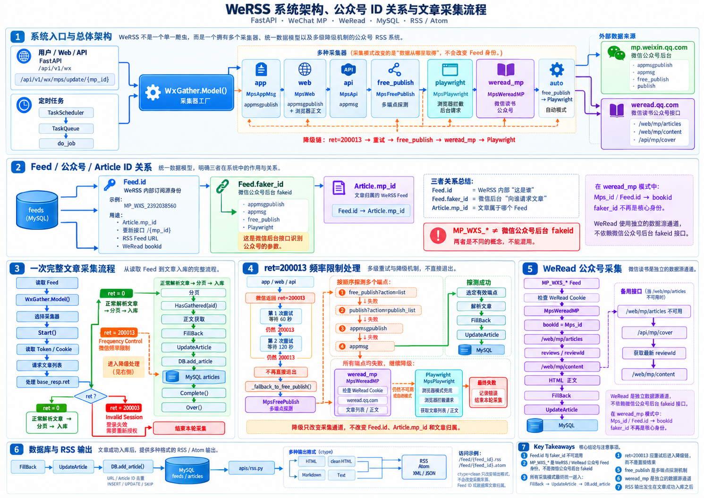
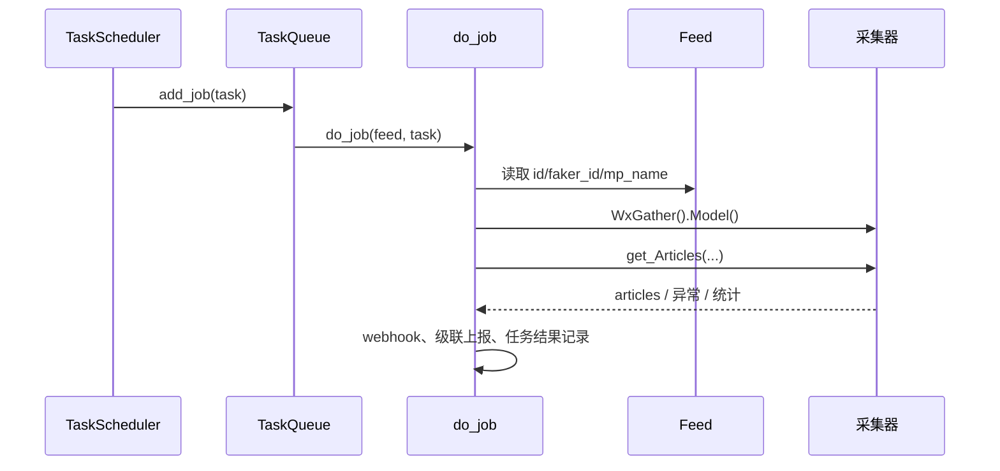
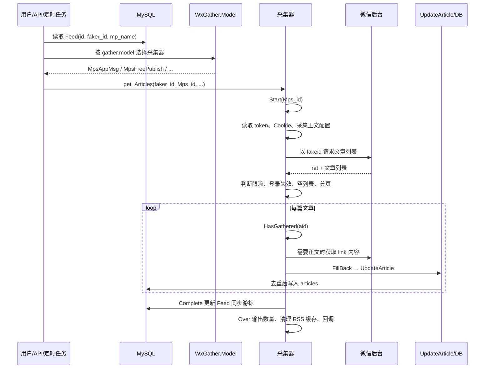
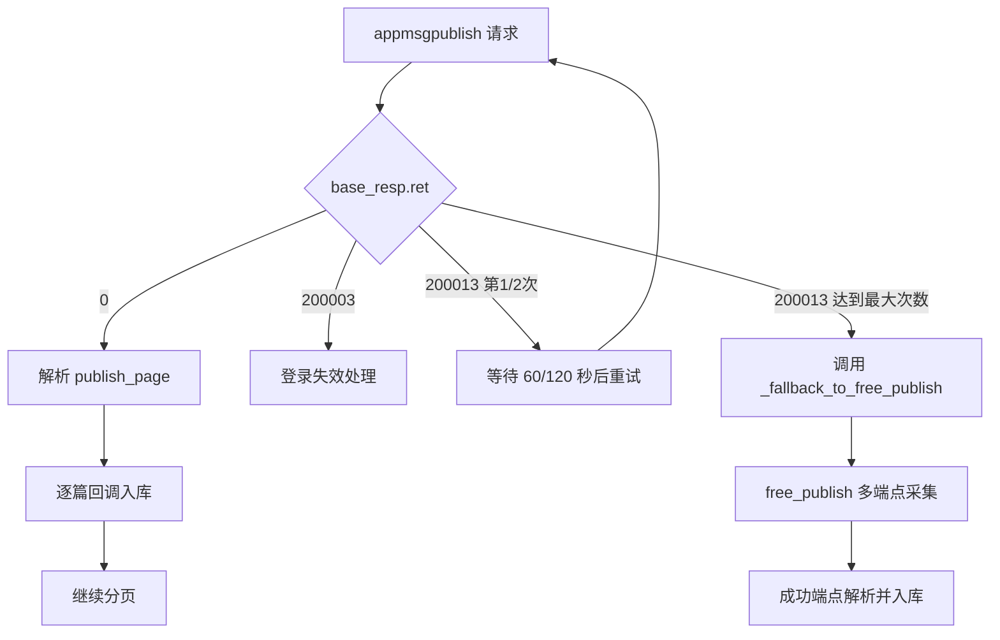
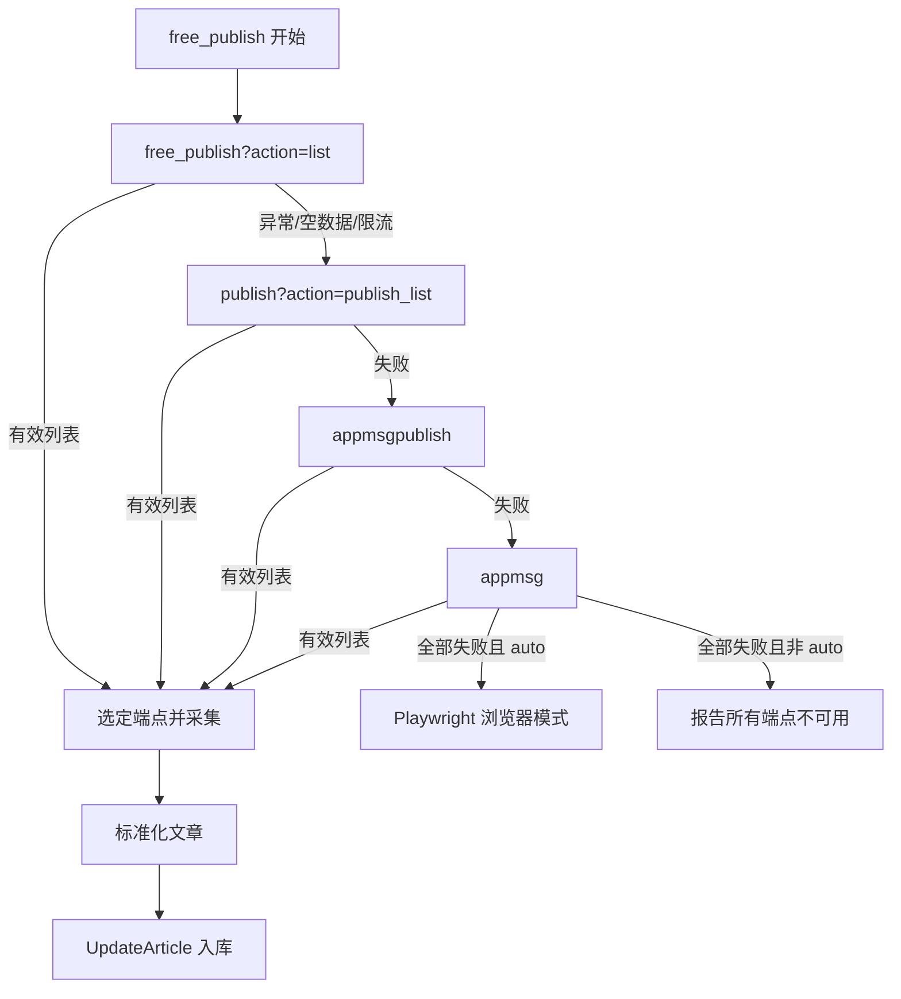
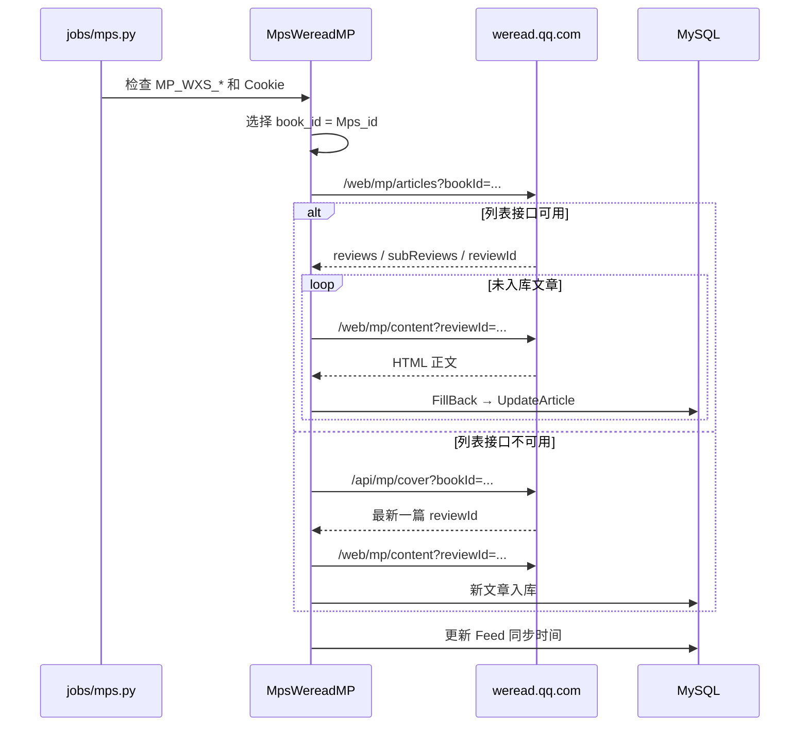
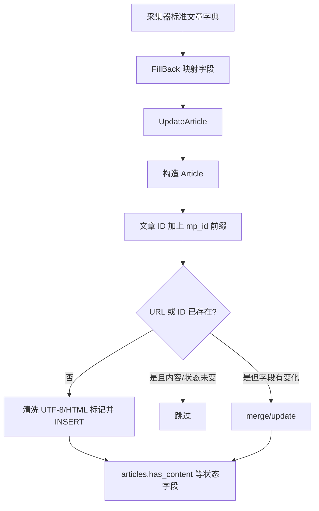
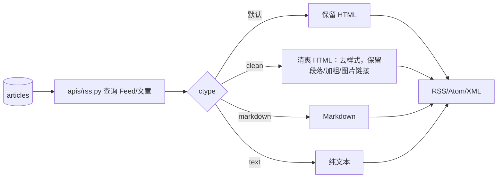

# WeRSS 程序原理、ID 关系与采集流程

本文基于当前仓库源码整理，目标是把“程序如何运行”“两个公众号 ID 各自做什么”“一次采集如何经过各层处理”说明清楚。文中的文件路径和函数名均以当前代码为准。

归档流程图：



## 1. 一句话概括

WeRSS 是一个 FastAPI 服务：用户或定时任务选择一个 Feed，系统根据配置选择采集器，从微信公众号后台或微信读书接口取得文章列表和正文，统一转换成内部文章对象，写入 `articles` 表，再通过 RSS/Atom 接口输出。

```mermaid
flowchart LR
    U[浏览器 / API 调用] --> W[web.py FastAPI]
    T[定时任务 jobs/mps.py] --> Q[TaskQueue]
    Q --> J[do_job]
    W --> M[GET /api/v1/wx/mps/update/{mp_id}]
    M --> C[WxGather.Model]
    J --> C
    C --> A[公众号采集器]
    C --> R[微信读书公众号采集器]
    A --> E[微信公众平台接口]
    A --> P[文章正文获取]
    R --> WR[weread.qq.com]
    E --> N[标准化文章对象]
    P --> N
    WR --> N
    N --> F[FillBack]
    F --> S[UpdateArticle]
    S --> D[(MySQL: feeds / articles)]
    D --> RSS[/RSS、Atom、JSON/]
```

## 2. 程序的主要层次

### 2.1 Web 入口层

`web.py` 创建 FastAPI 应用，并把各业务路由挂载到 `/api/v1/wx` 下。公众号管理路由来自 `apis/mps.py`，RSS 路由来自 `apis/rss.py`，微信读书相关接口来自 `apis/weread.py`。

主要入口包括：

| 入口 | 作用 |
|---|---|
| `/api/v1/wx/mps/update/{mp_id}` | 手动更新某个公众号 |
| 消息任务 / 定时任务 | 批量或按计划更新多个 Feed |
| `/feed/{feed_id}.rss` | 输出指定 Feed 的 RSS |
| `/feed/{feed_id}.atom` | 输出 Atom |
| `/api/v1/wx/weread/*` | 微信读书 Cookie、状态和采集管理 |

手动更新接口从 `feeds` 表读出 Feed，然后调用：

```text
WxGather().Model().get_Articles(
    mp.faker_id,
    Mps_id=mp.id,
    Mps_title=mp.mp_name,
    CallBack=UpdateArticle,
    start_page=start_page,
    MaxPage=end_page,
)
```

对应源码：`apis/mps.py:update_mps()`。

### 2.2 任务调度层

定时任务位于 `jobs/mps.py`：



对于 `MP_WXS_*` Feed，`jobs/mps.py` 会优先检查微信读书 Cookie；如果 Cookie 已配置，则把采集器切换为 `MpsWereadMP`。因此，定时任务中的 `MP_WXS_*` 不一定走普通微信公众号后台接口。

### 2.3 采集器工厂层

`core/wx/base.py:WxGather.Model()` 根据 `gather.model` 返回采集器：

| 配置值 | 采集器 | 主要来源 |
|---|---|---|
| `app` | `MpsAppMsg` | `appmsgpublish` |
| `web` | `MpsWeb` | `appmsgpublish`，正文走浏览器提取 |
| `api` | `MpsApi` | `appmsg` |
| `free_publish` | `MpsFreePublish` | `free_publish`、`publish`、旧端点 |
| `playwright` | `MpsPlaywright` | 浏览器拦截后台请求 |
| `auto` | `MpsFreePublish` + 自动兜底 | free_publish → Playwright |
| `weread` | `MpsWeread` | 微信读书书架、划线、笔记 |
| `weread_mp` | `MpsWereadMP` | 微信读书公众号文章 |

这里的“模式”是采集实现，不是 Feed 的身份。一个 Feed 可以因为配置或运行时条件切换采集器，但它在数据库中的 Feed ID 不应随模式变化。

## 3. 两种 ID 的用途

### 3.1 `Feed.id`：WeRSS 内部 Feed / 公众号记录 ID

`core/models/feed.py` 中的 `Feed.id` 是 `feeds` 表主键。当前微信读书公众号通常形如：

```text
MP_WXS_2392038560
```

它主要用于：

1. 标识 WeRSS 中的订阅源。
2. 作为 `Article.mp_id`，把文章归属到某个 Feed。
3. 作为 `/api/v1/wx/mps/update/{mp_id}` 的路径参数。
4. 作为 RSS 地址中的 Feed 标识，例如 `/feed/MP_WXS_...rss`。
5. 在微信读书公众号模式中作为 `bookId` 使用。
6. 在文章入库时参与生成全局文章 ID。

`MP_WXS_` 的含义不是普通微信公众号后台的 `fakeid`，而是项目用于表示微信读书公众号订阅源的 Feed 标识。

### 3.2 `Feed.faker_id`：微信公众号后台的 `fakeid`

`core/models/feed.py` 中的 `faker_id` 是普通微信公众号后台接口需要的标识。普通公众号接口请求中会传：

```text
fakeid = Feed.faker_id
```

它主要用于：

1. 调用 `appmsgpublish`、`appmsg`、`free_publish` 等微信公众号后台接口。
2. 构造公众号后台列表请求的 `fakeid` 参数。
3. Playwright 模式中拼接或拦截公众号后台请求。
4. 公众号搜索、导入、同步时作为平台侧身份标识。

### 3.3 两者在一次普通采集中的关系

```mermaid
flowchart TD
    F[(feeds 一行)]
    F --> I[Feed.id\nWeRSS 内部身份\nMP_WXS_* 或其他 Feed ID]
    F --> Z[Feed.faker_id\n微信公众号后台 fakeid]
    F --> N[Feed.mp_name\n展示名称]
    I --> AR[Article.mp_id]
    I --> API[更新接口路径 /{mp_id}]
    I --> URL[RSS Feed URL]
    Z --> WX[微信公众平台请求参数 fakeid]
    N --> LOG[日志 / RSS 标题 / 回调扩展信息]
```

可以把它简单理解成：

```text
Feed.id       = WeRSS 内部“这是谁”
Feed.faker_id = 微信后台接口“向谁请求列表”
Article.mp_id = 文章归属哪个 WeRSS Feed
```

### 3.4 微信读书公众号模式中的特殊关系

当 Feed 是 `MP_WXS_*` 且微信读书 Cookie 已配置时，`MpsWereadMP.get_Articles()` 会把：

```text
book_id = Mps_id（如果它是 MP_WXS_*）
```

然后请求微信读书接口：

```text
GET https://weread.qq.com/web/mp/articles?bookId=MP_WXS_...
GET https://weread.qq.com/web/mp/content?reviewId=...
```

新版代码还会在文章列表接口不可用时回退到：

```text
GET https://weread.qq.com/api/mp/cover?bookId=MP_WXS_...
```

此时 `faker_id` 不再是微信公众平台请求的核心身份；核心身份变成 `Mps_id / MP_WXS_*`。

## 4. 一次普通公众号采集的完整处理逻辑



具体步骤如下：

1. 读取 Feed。系统获取 `id`、`faker_id`、公众号名称和同步时间。
2. 选择模式。`WxGather.Model()` 根据 `gather.model` 返回对应采集器。
3. 开始采集。`Start()` 清空本次内存文章列表，重新读取 token/Cookie，并记录开始时间。
4. 请求列表。普通微信公众号模式将 `faker_id` 放进微信后台请求的 `fakeid` 参数。
5. 处理响应。判断 `base_resp.ret`，包括成功、频率限制、登录失效及其他错误。
6. 处理文章。每篇文章先经过 `HasGathered(aid)`，避免本次运行中重复处理。
7. 获取正文。如果 `GATHER.CONTENT=True`，根据文章链接获取正文；否则只保存列表信息。
8. 标准化回调。`FillBack()` 将平台返回字段转换成统一文章字典，并调用 `UpdateArticle()`。
9. 数据库去重。`DB.add_article()` 按 URL 或组合后的文章 ID检查已有记录；新文章写入，已有文章按条件更新或跳过。
10. 完成采集。正常完成后 `Complete()` 更新 Feed 的 `sync_time/update_time`。
11. 收尾。`Over()` 打印成功数量、耗时，清理对应 RSS 缓存，并执行完成回调。

## 5. `app` 模式的处理和降级

`core/wx/model/app.py` 使用 `appmsgpublish`。当前 `ret=200013` 的流程是：



`_fallback_to_free_publish()` 是已有函数，不重复实现。它创建 `MpsFreePublish`，共享当前 token、Cookie 和 session，然后继续使用相同的 `faker_id`、`Mps_id`、分页和回调参数。

需要注意：`app` 的降级只改变采集器，不改变 Feed 身份，也不改变文章归属。降级前后仍然是同一个：

```text
faker_id → 请求公众号列表
Mps_id   → Article.mp_id / RSS Feed
CallBack → UpdateArticle
```

## 6. `free_publish` 多端点逻辑

`MpsFreePublish` 先逐个探测端点，找到可以返回有效文章列表的端点后，再使用它进行分页采集：



因此日志中出现：

```text
尝试端点: free_publish
尝试端点: publish
尝试端点: appmsgpublish
尝试端点: appmsg
```

并不代表四组文章都被重复入库；它们是“探测可用端点”的顺序，实际采集只使用最终选中的有效端点。

## 7. 微信读书公众号采集逻辑

`weread_mp` 是另一条数据源通道，不依赖微信公众号后台 `fakeid` 接口。



微信读书文章链接中的 token 还涉及一个兼容处理：微信读书返回的部分 token 使用 `~` 表示原始微信链接中的 `_`，`core/wx/model/weread_mp.py` 在构造 `mp.weixin.qq.com/s/...` 前会将 `~` 还原为 `_`。

## 8. 数据库写入和去重

文章对象进入 `UpdateArticle()` 后，最终由 `core/db.py:add_article()` 处理：



`Article.mp_id` 是文章到 Feed 的归属关系；`Article.id` 是文章唯一键的一部分，不等同于公众号的 `faker_id`。

## 9. RSS 输出链路

采集入库和 RSS 输出是两个阶段：



这意味着 RSS 地址中的 `MP_WXS_*` 仍然对应 `Feed.id`，而不是 `faker_id`。`ctype=clean` 只影响输出内容格式，不改变文章采集来源和数据库归属。

## 10. 用 AI 继续绘图或解释代码的提示词

下面的提示词可以交给支持 Mermaid 的 AI 使用。建议每次同时提供当前仓库版本和相关源码片段，避免 AI 根据旧版本猜测。

### 10.1 总体架构图提示词

```text
你是资深 Python/FastAPI 系统架构师。请阅读这个 WeRSS 项目的 web.py、apis/mps.py、jobs/mps.py、core/wx/base.py、core/wx/model/*.py、jobs/article.py、core/db.py 和 core/rss.py。

请只根据源码事实绘制一张 Mermaid flowchart，展示：
1. Web/API 和定时任务两个入口；
2. WxGather.Model() 如何选择采集器；
3. 微信公众平台、微信读书、Playwright 三类外部数据源；
4. FillBack、UpdateArticle、DB.add_article 和 RSS 输出；
5. 用虚线标出自动降级路径。

每条边附一句简短说明；不确定的地方标注“需源码确认”，不要自行补全业务逻辑。
```

### 10.2 单次采集时序图提示词

```text
请根据当前源码绘制 Mermaid sequenceDiagram，参与者必须包含：用户/API、TaskQueue、do_job、Feed、WxGather.Model、具体采集器、外部接口、UpdateArticle、MySQL。

请完整表现一次采集：读取 Feed、选择模式、Start、请求列表、处理 ret、分页、正文获取、HasGathered、FillBack、去重入库、Complete、Over。
特别标注 ret=200013 的重试和降级路径，以及 ret=200003 的登录失效路径。
```

### 10.3 ID 关系解释提示词

```text
请读取 core/models/feed.py、core/models/article.py、core/wx/base.py、apis/mps.py、core/wx/model/weread_mp.py 和 core/db.py。

请输出一张 ID 映射图和一张表，明确区分：
- Feed.id
- Feed.faker_id
- Article.mp_id
- Article.id / aid
- 微信读书 bookId
- 微信读书 reviewId

对每个字段说明来源、用途、在哪些 HTTP 请求中使用、是否可以替换，以及替换后会影响什么。只写代码能够证明的结论。
```

### 10.4 日志诊断提示词

```text
你是 WeRSS 运行日志诊断助手。请将下面日志按“入口、采集模式、端点探测、响应状态、是否入库、是否更新游标、是否清理 RSS 缓存”分段解释。

请区分：
1. 请求失败；
2. 接口返回空数据；
3. 文章重复被数据库跳过；
4. 任务成功但新增文章为 0；
5. 所有 HTTP 端点失败后进入 Playwright。

不要仅因为出现“成功0条”就判断程序崩溃，要结合后续日志和 Feed 游标更新判断。
```

## 11. 当前阅读代码后的关键结论

1. `Feed.id` 是 WeRSS 内部订阅源身份，`Feed.faker_id` 是微信公众号后台请求身份；两者不能混用。
2. `MP_WXS_*` 更接近微信读书公众号 Feed/bookId，不是普通微信后台 `fakeid`。
3. 一次采集的统一落点是 `FillBack → UpdateArticle → DB.add_article`，不同采集模式主要区别在“列表和正文从哪里取”。
4. `app` 遇到 `ret=200013` 时，前两次等待重试，达到上限后应调用现有 `_fallback_to_free_publish()` 并 `return`，避免继续执行原来的停止分支。
5. `free_publish` 是多端点探测与选择机制；`auto` 模式在 HTTP 端点均不可用时还会尝试 Playwright。
6. 微信读书公众号模式是独立链路，依赖 Cookie，并使用 `MP_WXS_*` 作为 `bookId`；它不能等同于普通微信公众号后台采集。
7. RSS 输出发生在采集入库之后，`ctype=clean` 是内容呈现层选项，不会改变采集 ID、文章归属或原始正文存储。

## 12. 代码阅读范围

本说明重点依据以下源码：

- `web.py`
- `apis/mps.py`
- `apis/rss.py`
- `apis/weread.py`
- `jobs/mps.py`
- `jobs/article.py`
- `core/models/feed.py`
- `core/models/article.py`
- `core/wx/base.py`
- `core/wx/model/app.py`
- `core/wx/model/free_publish.py`
- `core/wx/model/api.py`
- `core/wx/model/web.py`
- `core/wx/model/playwright_mp.py`
- `core/wx/model/weread.py`
- `core/wx/model/weread_mp.py`
- `core/db.py`
- `core/rss.py`
- `docs/weread-mp.md`

本文是代码结构说明，不替代线上日志验证；当配置、镜像或分支改变时，应重新以实际运行版本读取并更新本文。
